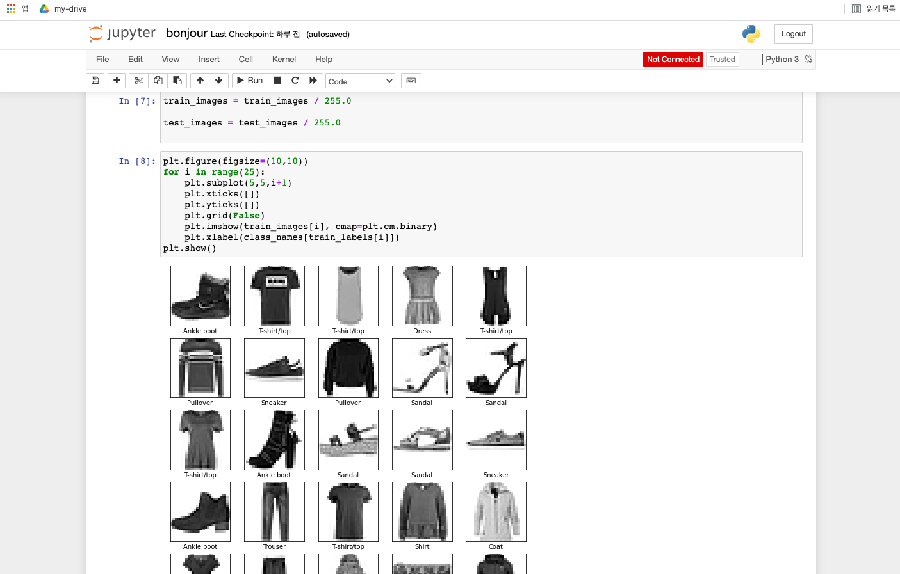
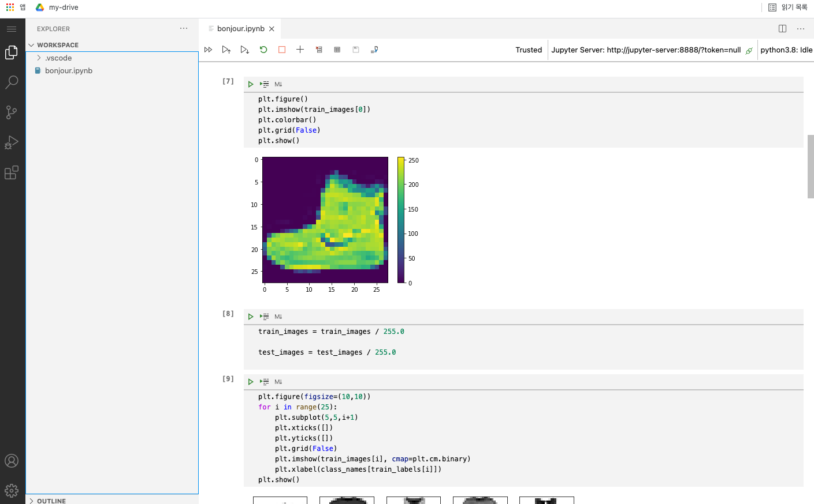
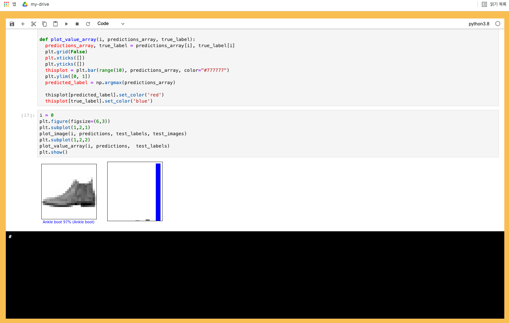

# Dev. with Remote Jupyter Server
Jupyter Server 를 활용하여 ipython 및 기타 개발 환경을 구축하고,  
Multi User 가 Jupyter Server 를 동시에 활용할 수 있게 하여, Resource 사용의 효율화를 이루는 방안.

<u>*기존 Jupyter Notebook 활용 구성은 아래와 같다.*</u>
- Jupyter Notebook 에 직접 browser 해서 web 접속.

@startuml
"Client" as client1
"Client" as client2
node "EKS" as eks {
  rectangle "Jupyter Notebook" as notebook1 {
    storage "src" as repo1
    (kernel2) as k012
    (kernel1) as k011
  }
  rectangle "Jupyter Notebook" as notebook2 {
    storage "src" as repo2
    (kernel2) as k022
    (kernel1) as k021
  }
}
node "EBS" as ebs {
  storage "Kernel Storage" as store2
  storage "Kernel Storage" as store1
}
client1 -down-> notebook1
client2 -down-> notebook2
notebook1 -down- store1
notebook2 -down- store2
@enduml

## VS Code Extension
Visual Studio Code 의 Python extension 을 활용하면 Jupyter Notebook Editor 를 활용한 개발이 가능.  
Python code 의 실행을 Remote Jupyter Server 로 offloading 처리.

> VS Code Jupyter Notebook Support 참조
<https://code.visualstudio.com/docs/python/jupyter-support>

### Local IDE + Remote Jupyter Server
- ipython 개발환경은 Local 에 구성
- run 은 Remote Jupyter Server 사용
  - 단점: Local 환경 구성 역량 필요
  - 장점: Local 에서 개발, GPU 필요시 Jupyter Server 연결

@startuml
rectangle "Local" as loc01 {
  "Client" as client1
  ("VS Code") as code1
  storage "src" as repo1
}
rectangle "Local" as loc02 {
  "Client" as client2
  ("VS Code") as code2
  storage "src" as repo2
}
node "EKS" as eks {
  rectangle "Jupyter Server" as jupyter {
    (kernel2) as k02
    (kernel1) as k01
  }
}
node "EBS" as ebs {
  storage "Block Storage" as store
}
client1 -down-> code1
client2 -down-> code2
code1 - repo1
code2 - repo2
code1 -down-> k01
code1 -down-> k02
code2 -down-> k01
code2 -down-> k02
k01 -down- store
k02 -down- store
@enduml

- 구현 내역

### VS Code Server + Remote Jupyter Server
- ipython 개발환경을 Code Server 로 구성
- run 은 Remote Jupyter Server 사용
  - 단점: coder server 가 local vs code 와 완전히 동일한 환경을 제공해주지는 않음
  - 장점: browser 를 통한 접속 방식은 유지 가능

@startuml
"Client" as client1
"Client" as client2
node "EKS" as eks {
  ("VS Code") as code1
  storage "src" as repo1
  ("VS Code") as code2
  storage "src" as repo2
  rectangle "Jupyter Server" as jupyter {
    (kernel2) as k02
    (kernel1) as k01
  }
}
node "EBS" as ebs {
  storage "Block Storage" as store
}
client1 -down-> code1
client2 -down-> code2
code1 - repo1
code2 - repo2
code1 -down-> k01
code1 -down-> k02
code2 -down-> k01
code2 -down-> k02
k01 -down- store
k02 -down- store
@enduml

- 구현 내역

## Frontend Standalone App.
jupyterlab frontend module 을 활용하여, standalone frontend app 을 개발하여 활용도 가능은 함.

> Jupyter standalone app 개발 참조
<https://jamiehall.eu/posts/standalone-jupyter-application>

@startuml
"Client" as client1
"Client" as client2
node "EKS" as eks {
  ("Frontend App") as feapp
  rectangle "Jupyter Server" as jupyter {
    (kernel2) as k02
    (kernel1) as k01
    storage "src" as repo
  }
}
node "EBS" as ebs {
  storage "Block Storage" as store
}
client1 -down-> feapp
client2 -down-> feapp
feapp - repo
feapp -down-> k01
feapp -down-> k02
k01 -down- store
k02 -down- store
@enduml

- 구현 내역

