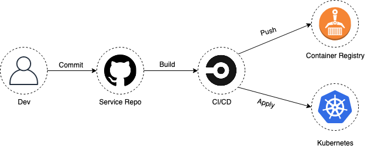
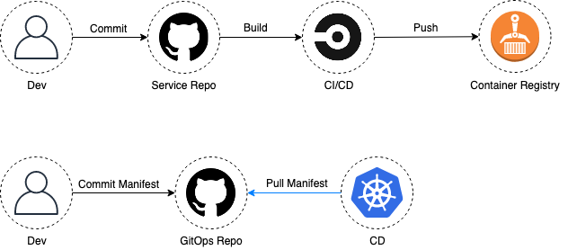
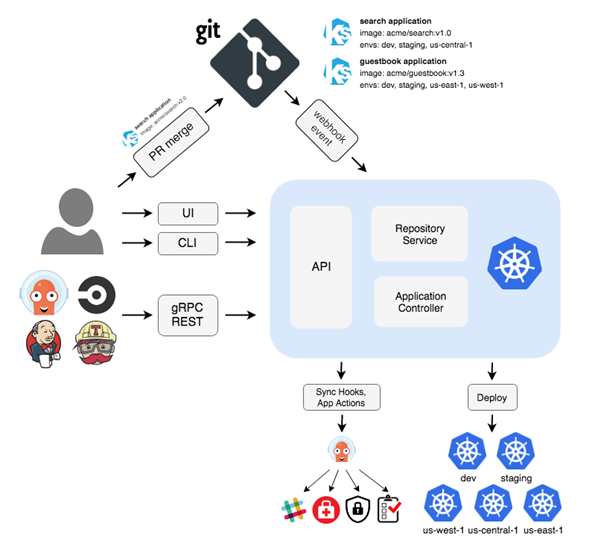
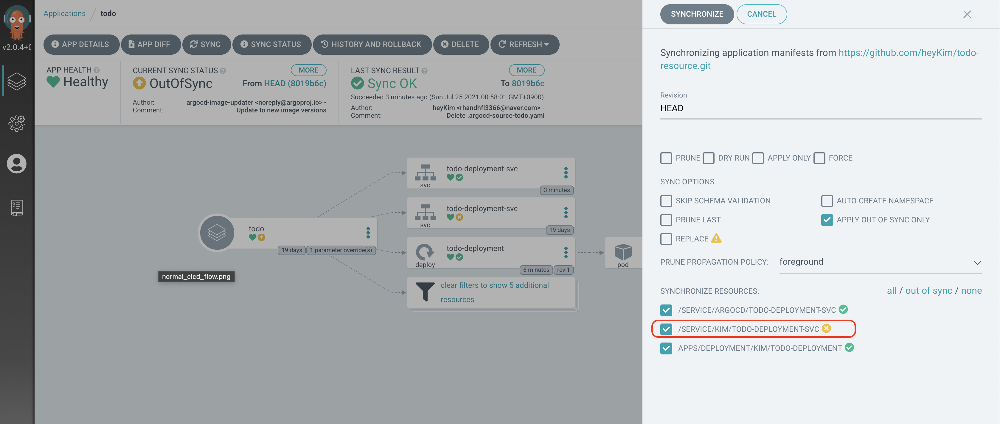

# 1조 소과제: ArgoCD

## GitOps
### GitOps란
* GitOps란, 배포의 형상을 선언형으로 기술하여 Config 리포지토리에서 관리하고 이를  운영 환경 간의 상태 차이가 없도록 유지하는 방식을 말한다. 즉, 배포할 쿠버네티스 리소스를 Git 리포지토리에 올려놓으면 실제 운영 중인 클러스터와 차이가 발생하게 되고 이를 감지하고 클러스터에 동기화해주는 어플리케이션이 동기화(Sync)를 수행하여 지속적으로 배포가 이루어지도록 하는  방식이다.
* GitHub 등의 웹 UI에 들어가면 배포된 상태를 편하게 확인할 수 있고 단일 진실 원천(Single source of truth)으로 신뢰성도 담보된다. 또한, Git 커밋을 통해 관리되기 때문에 별도 설정이나 시스템 구축 없이도 배포 이력이나 감사 로그를 쌓을 수 있다. 롤백도 Git의 특정 리비전을 참고하여 동기화하는 것이라, 기존 배포 결과가 OK 상태였다고 하면 해당 리비전으로 롤백 했을 때 배포에 문제가 발생하지 않는다.
* 핵심은 git repo에 저장된 쿠버네티스 매니페스트 같은 파일을 이용해 배포를 선언적으로 하는 것!
* IaC와 다른 점은?
    * IaC가 더 상위 개념으로 모든 인프라를 관리하기 위한 패턴이며, GitOps는 git이라는 특화된 소스 버전 관리 도구를 기반으로 kubernetes의 자원을 관리하는 목적으로 세분화된 기술임


|       | GitOps             | IaC                     |
|-------|--------------------|-------------------------|
| 관리대상| Kubernetes 리소스들   |  모든 인프라(local,Cloud,Kubernetes)    |
| 원천소스| git |  git 외에도 설정 저장가능 |
| 개념   | IaC 중 Kubernetes에 특화된 패턴     | 인프라를 관리하는 패턴    |
| 도구   | argocd, flux  |  terraform, ansible, chef 등    |

---
### GitOps 배포방식
* Push 방식


* Pull 방식


Basics <https://www.gitops.tech/#what-is-gitops>
Push-based vs. Pull-based Deployments <https://www.gitops.tech/#push-based-vs-pull-based-deployments>
Key Benefits <https://www.weave.works/technologies/gitops/#key-benefits-of-gitops>
정리하기

## ArgoCD란

### ArgoCD 장점
1. 모든 변경사항이 git rep에 저장 되어있기 때문에 검증하거나 감사(audit)하기 쉽다.
2. git repo라는 single source of truth 를 가지기 때문에 환경을 쉽고 일관성 있게 복제 할 수 있다. 장애 복구 시 매우 유용
3. git을 사용하기 때문에 개발자들에게 learning curve가 적다.
4. rollback 이 쉽다.

### ArgoCD의 Key Component
1. API Server  
ArgoCD는 다른 외부 시스템과 interact 하기 위한 API를 제공하는 API Server가 있다. API Server는 Application, repository, cluster credential, 인증 및 권한 부여 등을 관리한다.
2. Repository server  
Repository server는 k8s manifest file이 있는 git repository의 로컬 캐시를 유지한다. git repo에서 manifest 정보를 가져올 때 이 repository server를 호출하게 된다.
3. Application controller  
Application controller는 배포된 application 의 state와 정의된 desired state를 계속해서 비교하여 서로 동기화 되지 않을 때마다 API Server에 report하는 역할을 담당한다.
    - 3분마다 git을 polling(`argo-cd` ConfigMap에 설정되어있어서 변경가능함)


### Key objects/resources in Argo CD
1. Application 
* ArgoCD는 Application이라는 k8s custom resource definition(CRD)를 통해서 배포하고자 하는 application의 instance를 나타낸다.
* 이 ArgoCD Application 안에 생성할 application의 K8s manifest 파일이 있는 git repo, 배포하고자 하는 k8s server, namsepace 등등의 정보를 정의한다.
2. App Project
* 쿠버네티스의 namespace와 비슷한 개념으로 여러 App을 논리적인 project로 구분하기 위해 사용되는 ArgoCD CRD
3. Repo Credentials
* repository에 접근하기 위해서 필요한 credential. ArgoCD는 git url을 arogocd-cm이라는 ConfigMap에 저장하고 credential 가 담긴 secret 을 사용한다.
4. Cluster Credentials: ArgoCD가 설치된 cluster가 아닌 다른 cluster에 접근할 때 사용됨
## ArgoCD 실습

* Jenkins 설치 및 설정(작성중)
* ArgoCD
    * ArgoCD 설치
    * ArgoCD CLI
    * ArgoCD 설정(Application 생성, ArgoCD Image Updater 설정)

### Jenkins 설치(작성중)
### ArgoCD 설치
* helm repo 추가
```bash
helm repo add argo https://argoproj.github.io/argo-helm
```
* config 수정을 위해서 source 다운로드 및 소스 수정 후 argocd 설치
```bash
# source 다운로드
helm fetch argo/argo-cd

# source 수정
# argocd 서버를 외부에서 접속하기 위해서 Service Type만 ClusterIP에서 LoadBalancer로 변경해줌

# helm install 하여 argocd 설치
helm install "argo cd이름 지정" argo/argo-cd

# 설치 시 수정한 values.yaml을 적용하고 싶을 때
helm install "argo cd이름 지정" argo/argo-cd -f ./values.yaml
```
* 설치 후 패스워드 확인
```bash
# secret 에서 패스워드 확인(id는 admin이 default)
kubectl -n argocd get secret argocd-initial-admin-secret -o jsonpath="{.data.password}" | base64 -d

# `argocd-initial-admin-secret`는 password 변경 후에 namespace를 지워야한다고 함.(공홈 피셜)
```

### ArgoCD CLI
#### 접속


### ArgoCD 설정
#### 둘러보기

ArgoCD는 `Application`라는 CRD(Custom Resource Definition)를 제공한다. Application은 Kubernetes resources 묶음으로 배포를 책임진다.
#### Application 생성


* Application Name: App의 이름을 적는다.
* Project: 프로젝트를 선택하는 필드. 쿠버네티스의 namespace와 비슷한 개념으로 여러 App을 논리적인 project로 구분하여 관리할 수 있다.
* Sync Policy: Git 저장소의 변경 사항을 어떻게 sync할지 결정. Auto는 자동으로 Git 저장소의 변경사항을 운영에 반영하고 Manual은 사용자가 버튼 클릭 혹은 API를 통해 직접 운영 반영을 해야함.
* Repository URL: ArgoCD가 바라볼 Git 저장소를 의미
* Revision: Git의 어떤 revision (HEAD, master branch 등)을 바라 볼지 결정
* Path: Git 저장소에서 어떤 디렉토리를 바라 볼지 결정함. (dot(.)인 경우 root path를, 디렉토리 이름을 적으면 해당 디렉토리의 배포 정의서만 tracking 함)
* Cluster: 쿠버네티스의 어느 클러스터에 배포할지를 결정
* Namespace: 쿠버네티스 클러스터의 어느 네임스페이스에 배포할지를 결정
* Kubernetes manifests Tool 선택: Kubernetes manifest를 정의할 tool 을 선택하고 설정 정보를 입력한다.


ArgoCD Application 생성 후, 동기화 이전이라 `OutOfSync`상태

config repo에서 Deployment의 namespace을 변경하니 이를 감지하여 동기화가 필요한 상태임을 표시해줌
#### ArgoCD Image Updater
* Argo CD로 관리되는 k8s workload의 container image를 자동으로 업데이트 해주는 기능. 
* resouce yaml에 image 버전 등을 일일이 업데이트 할 필요없이 새로운 이미지의 업데이트를 자동으로 감지하여 k8s 워크로드에 적용해준다.
* Argo CD가 관리하는 Application 리소스에 annotation을 부여하여 설정한다.
> **_NOTE:_**  아직 개발 중인 기능이다.
##### ArgoCD Image Updater 설정
1. argocd-image-updater 설치
```bash
# argocd 가 설치된 k8s workload에 설치
git clone https://github.com/argoproj-labs/argocd-image-updater/blob/master/manifests/install.yaml

# Apply the installation manifests¶
kubectl apply -n argocd -f manifests/install.yaml
```
2. Docker Registry에 대한 Access 권한 부여
3. ArgoCD Application에 annotation 추가
Auto Image Updater 설정을 하기 위해서는 annoatation을 추가 해주어야한다.
아래 command 로 annoation 추가해도 되고
```bash
kubectl annotate app argocd-updater-test -n argocd\
    argocd-image-updater.argoproj.io/image-list=registry-1.docker.io/jkk3366/jenkins \
    argocd-image-updater.argoproj.io/todo.force-update=true \
    argocd-image-updater.argoproj.io/write-back-method=git
```
ArgoCD UI에서 아래 annoation을 추가해주어도 된다.
```
argocd-image-updater.argoproj.io/image-list: jkk3366/jenkins
argocd-image-updater.argoproj.io/todo.force-update: true
argocd-image-updater.argoproj.io/write-back-method: git
```

## 장점
1. 선언적 방식 #너와나의연결고리 #우리는하나
: 동일한 state 임을 보장한다.<gitops 선언적 방식의 장점>
2. Rollback #손쉬운 #완벽한
: image tag만 바꾸는 것이 아니라 완벽한 rollback 가능
3. config 분리 적용가능 
4. multi cluster 관리용이 #한방에
5. 빌드없는 배포 가능(CD) #SRE를 위한
: helm, daemonset 등

그림 넣기
