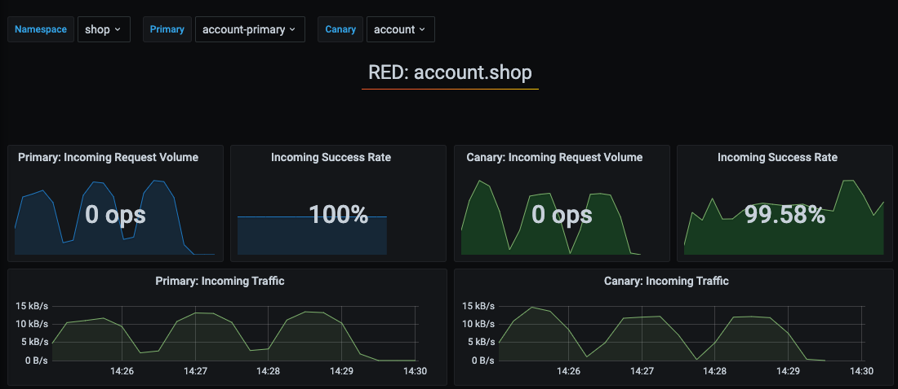
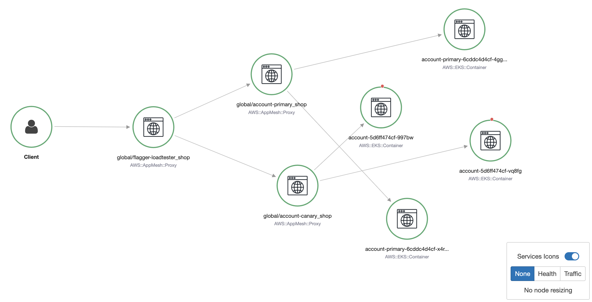

# Flagger on EKS App Mesh

AWS 에서 제공하는 Service Mesh 인 Amazon App Mesh 에서, Flagger 를 활용한 Kubernetes Object Delivery 환경 구성 및 FluxCD 기반 Amazon EKS GitOps 환경과의 통합.

- App Mesh integration with Amazon EKS

  - Kubernetes custom resources : mesh, virtual nodes, routers, services 활용 (외부 노출을 위한 Virtual Gateway 는 제외)
  - CRD controller : App Mesh control plane 과 custom resource 의 동기화
  - Admission controller : Envoy sidecar injection 과 App Mesh virtual nodes 에 service (pod) assign
  - Telemetry service : appmesh 에서 제공하는 prometheus 활용
  - Progressive delivery operator : Flagger instance 를 활용한 canary release automation


> EKS GitOps Handson 참조
<https://eks.handson.flagger.dev/profile/#app-mesh-profile>


## Prerequisite

- GitOps Pipeline
  - 사전에 구성한 Amazon EKS cluster (ver. >= 1.16)
  - 사전에 구성한 ECR
  - 사전에 구성한 AWS Code Pipeline (CodeCommit + CodeBuild)
  - FluxCD 기반 k8s manifest repository 의 Pull based Deployment 환경

- Delivery Process
  - App Mesh Component 및 Prometheus 설치
  - Flagger 설치
> Flagger Official Docs 참조
<https://docs.flagger.app/install/flagger-install-on-eks-appmesh>

### Install App Mesh Components

- Helm repository 추가
```bash
helm repo add eks https://aws.github.io/eks-charts
```

- App Mesh CRD 설치 및 namespace 생성:

```bash
kubectl apply -k github.com/aws/eks-charts/stable/appmesh-controller//crds?ref=master

kubectl create ns appmesh-system
```

- App Mesh controller helm install

```bash
helm upgrade -i appmesh-controller eks/appmesh-controller \
--wait --namespace appmesh-system
```

- App Mesh Prometheus helm install
: Flagger 의 canary analysis 를 위해 필요한, App Mesh metric 수집을 위해 설치

```bash
helm upgrade -i appmesh-prometheus eks/appmesh-prometheus \
--wait --namespace appmesh-system
```


### Install Flagger

- Helm repository 추가
```bash
helm repo add flagger https://flagger.app
```

- Flagger CRD 설치
: Canary, AlertProvider, MetricTemplate,,

```bash
kubectl apply -f https://raw.githubusercontent.com/fluxcd/flagger/main/artifacts/flagger/crd.yaml
```

- App Mesh namespace 에 flagger helm install
```bash
helm upgrade -i flagger flagger/flagger \
--namespace=appmesh-system \
--set crd.create=false \
--set meshProvider=appmesh:v1beta2 \
--set metricsServer=http://appmesh-prometheus:9090
```

- Monitoring 을 위한, Flagger Grafana helm install
```bash
helm upgrade -i flagger-grafana flagger/grafana \
--set url=http://prometheus:9090
```


## Service Mesh Canary release

Service Mesh 기반 Flagger 의 Canary Release 에 대한 구성 내역.
Flagger 의 Canary custom resource 를 정의하여, Amazon App Mesh 기반의 canary release automation process 를 구성하였다.

> Flagger Official Docs 참조
<https://docs.flagger.app/tutorials/appmesh-progressive-delivery>


### App Mesh + Flagger

Flagger 는 Canary resource 에 정의된 target deployment 및 hpa 를 기반으로, primary 기준이 되는 deployment, service, hpa 등을 생성하는 것 뿐 아니라, 정의된 provider 에 맞는 service mesh 에 필요한 custom resource 를 생성한다.

App Mesh 의 경우, 수동으로 환경을 구성할 경우, Mesh, VirtualNode, VirtualService, VirtualRouter 등을 직접 k8s manifest 정의하고 apply 하여 생성해야 한다.
하지만, Flagger 의 Canary resource 를 활용하여 정의할 경우, 관련된 primary, canary route 를 위한 virtual node, service, router 를 자동으로 생성해주므로, App Mesh 구성을 위해 global 영역의 논리적 경계를 정의하는 mesh 만 직접 생성하였다.

- **Mesh resource manifest**

```yaml
apiVersion: appmesh.k8s.aws/v1beta2
kind: Mesh
metadata:
  name: global
spec:
  namespaceSelector:
    matchLabels:
      appmesh.k8s.aws/sidecarInjectorWebhook: enabled
  egressFilter:
    type: ALLOW_ALL
```

- **Virtual node, router, service 를 직접 생성할 경우 예시**

```yaml
---
# VirtualNode: k8s service 의 logical pointer 역할
apiVersion: appmesh.k8s.aws/v1beta2
kind: VirtualNode
metadata:
  name: mariadb-shop
spec:
  podSelector:
    matchLabels:
      app: mariadb-shop
  listeners:
  - portMapping:
      port: 3306
      protocol: tcp
  serviceDiscovery:
    dns: # service 지정
      hostname: mariadb-shop.shop-infra.svc.cluster.local.

---
# VirtualRouter: VirtualService 의 traffic 을 VirtualNode 로 routing
apiVersion: appmesh.k8s.aws/v1beta2
kind: VirtualRouter
metadata:
  name: mariadb-shop
spec:
  listeners:
  - portMapping:
      port: 3306
      protocol: tcp
  routes:
  - name: route-to-mariadb-shop
    tcpRoute:
      action:
        weightedTargets:
        - virtualNodeRef:
            name: mariadb-shop
          weight: 1

---
# VirtualService: 실제 k8s service 를 추상화한 object. service name 과 동일하게 생성
apiVersion: appmesh.k8s.aws/v1beta2
kind: VirtualService
metadata:
  name: mariadb-shop
spec:
  awsName: mariadb-shop.shop-infra
  provider:
    virtualRouter:
      virtualRouterRef:
        name: mariadb-shop
```


- **App Mesh Traffic Flow 예시**


> Amazon App Mesh Official Docs 참조
<https://docs.aws.amazon.com/app-mesh/latest/userguide/what-is-app-mesh.html>


### Flagger Canary resource

기존에 FluxCD 기반으로 배포되어 있던, deployment, hpa 구성을 target 으로 하는 Canary Resource 를 생성한 내역

- **Canary resource manifest 예시**
```yaml
apiVersion: flagger.app/v1beta1
kind: Canary
metadata:
  name: <name>
spec:
  provider: appmesh:v1beta2
  # target deployment 정의
  targetRef:
    apiVersion: apps/v1
    kind: Deployment
    name: <name>
  progressDeadlineSeconds: 300
  # target hpa 정의
  autoscalerRef:
    apiVersion: autoscaling/v2beta2
    kind: HorizontalPodAutoscaler
    name: <name>
  # expose 를 위한 service 정의 (ClusterIP)
  service:
    port: <port>
    backends: # App Mesh 일 경우, virtual service egress 허용을 위해 추가해주어야 하는 내용
      - arn:aws:appmesh:ap-northeast-2:170247361816:mesh/global/virtualService/mariadb-shop.shop-infra
      - arn:aws:appmesh:ap-northeast-2:170247361816:mesh/global/virtualService/rabbitmq.shop-infra
      - arn:aws:appmesh:ap-northeast-2:170247361816:mesh/global/virtualService/redis-session.shop-infra
  # canary analysis 정의 영역
  skipAnalysis: false # true 일 경우, 곧바로 canary promotion
  analysis:
    # schedule interval (default 60s)
    interval: 30s
    # max number of failed metric checks before rollback
    threshold: 3
    # 도달하기 위한 최대 가중치 값 정의, percentage (0-100)
    maxWeight: 80
    # traffic 가중치 증가 단위, percentage (0-100)
    stepWeight: 20
    # App Mesh Prometheus 의 metric check
    ### flagger 의 service mesh metric check 는 기본적으로 아래의 2가지 항목을 제공
    ### request 성공률, duration
    metrics:
    - name: request-success-rate
      # minimum req success rate (non 5xx responses), percentage (0-100)
      thresholdRange:
        min: 99
      interval: 1m
    - name: request-duration
      # maximum req duration P99, milliseconds
      thresholdRange:
        max: 500
      interval: 30s
    # 생성한 alert provider 를 reference 로 하여, slack channel 에 message 전송
    ### slack web hook url 기반으로 namespace 에 alert provider 미리 생성함.
    alerts:
      - name: "dev team Slack"
        severity: info
        providerRef:
          name: on-call
          namespace: shop
    # webhook 기반 Testing (optional)
    ### rollout type 으로 정의하여, weight 가 변경될 때 마다, curl command 를 호출하는 url 호출
    ### flagger-loadtester application 을 미리 배포하였음.
    webhooks:
    - name: acceptance-test
      type: rollout
      url: http://flagger-loadtester.shop/
      timeout: 60s
      metadata:
        type: bash
        cmd: "curl -X GET http://account-canary.shop:8180/v1/accounts/events"
```

- **Alert Provider 생성 manifest 예시**

```yaml
apiVersion: flagger.app/v1beta1
kind: AlertProvider
metadata:
  name: on-call
spec:
  type: slack
  channel: on-call-alerts
  username: flagger
  # webhook address (ignored if secretRef is specified)
  address: <webhook address>
```

- **Canary resource 생성 시, generate 되는 object 내역**
: app name 은 account

```bash
# Flagger canary resource
canary.flagger.app/account

# target deployment, hpa 의 primary object
deployment.apps/account-primary
horizontalpodautoscaler.autoscaling/account-primary

# primary service 와 weight routing 을 위한 canary service
service/account                ClusterIP
service/account-canary         ClusterIP
service/account-primary        ClusterIP

# App Mesh resource, AWS 의 arn 이 부여됨.
virtualnode.appmesh.k8s.aws/account-canary       arn:aws:appmesh:ap-northeast-2:170247361816:mesh/global/virtualNode/account-canary_shop
virtualnode.appmesh.k8s.aws/account-primary      arn:aws:appmesh:ap-northeast-2:170247361816:mesh/global/virtualNode/account-primary_shop
virtualrouter.appmesh.k8s.aws/account            arn:aws:appmesh:ap-northeast-2:170247361816:mesh/global/virtualRouter/account_shop
virtualrouter.appmesh.k8s.aws/account-canary     arn:aws:appmesh:ap-northeast-2:170247361816:mesh/global/virtualRouter/account-canary_shop
virtualservice.appmesh.k8s.aws/account           arn:aws:appmesh:ap-northeast-2:170247361816:mesh/global/virtualService/account.shop
virtualservice.appmesh.k8s.aws/account-canary    arn:aws:appmesh:ap-northeast-2:170247361816:mesh/global/virtualService/account-canary.shop
```

### Automated Canary Promotion

Spring Boot Application 의 application property 를 configmap volume 으로 mount 한 application 의 Canary release demo.

#### Test Scenario

1. k8s manifest git repository 의, spring boot application property 를 수정 후 commit & push.
2. FluxCD 에 의해서, kustomize reconciliation 수행하여, k8s configmap 재생성.
3. Flagger 에서 configmap 의 변경 event 를 감지하여, canary release process 시작.
4. Canary Release
  4-1. 변경된 configmap 으로 인해 application error 발생으로 pod 생성 실패
  4-2. alert provider 에 의해 slack message 수신
5. k8s manifest git repository 의, spring boot application property 올바른 값으로 수정 및 commit & push.
6. 2 ~ 4번 과정 다시 반복.
7. Canary Release
  7-1. request-success-rate metric 분석 threshold check 실패
  7-2. alert provider 에 의해 slack message 수신
8. Flagger canary resource 의 metric threshold 조정
9. Deployment rollout restart 수행.
10. Alert provider 에 의해 slack message 수신.

@startuml kubernetes

footer Kubernetes Plant-UML
scale max 1024 width

skinparam nodesep 10
skinparam ranksep 10

' Kubernetes
!define KubernetesPuml https://raw.githubusercontent.com/dcasati/kubernetes-PlantUML/master/dist

!includeurl KubernetesPuml/kubernetes_Common.puml
!includeurl KubernetesPuml/kubernetes_Context.puml
!includeurl KubernetesPuml/kubernetes_Simplified.puml

!includeurl KubernetesPuml/OSS/KubernetesSvc.puml
!includeurl KubernetesPuml/OSS/KubernetesPod.puml
!includeurl KubernetesPuml/OSS/KubernetesCm.puml
!includeurl KubernetesPuml/OSS/KubernetesCrd.puml
!includeurl KubernetesPuml/OSS/KubernetesDeploy.puml

actor "Dev." as userAlias
top to bottom direction

database "k8s git repo" as k8sgit
(#slack) as slack

' Kubernetes Components
Cluster_Boundary(cluster, "Kubernetes Cluster") {
    Namespace_Boundary(fluxns, "FluxCD") {
      KubernetesPod(source, "source-controller", "")
      KubernetesPod(kusto, "kustomize-controller", "")
    }
    Namespace_Boundary(flaggerns, "Flagger") {
        KubernetesPod(flagger, "flagger-controller", "")
    }
    Namespace_Boundary(appns, "App.") {
        KubernetesSvc(svc, "service", "")
        KubernetesSvc(svcc, "service-canary", "")
        KubernetesSvc(svcp, "service-primary", "")
        KubernetesPod(loadtest, "load-tester", "")
        KubernetesPod(pod, "pod", "")
        KubernetesPod(podp, "pod-primary", "")
        KubernetesDeploy(deploy, "deploy", "")
        KubernetesDeploy(deployp, "deploy-primary", "")
        KubernetesCm(cm, "confimap", "")
        KubernetesCm(cmp, "configmap-primary", "")
        KubernetesCrd(canary, "canary", "")
        KubernetesCrd(alert, "alert-provider", "")
    }
}

Rel(userAlias,k8sgit," ")
Rel(k8sgit,source, "source code scan")
Rel(source,kusto, "noti.")
Rel(kusto,cm, "Reconciliation")

Rel(svc, svcc," ")
Rel(svc, svcp," ")
Rel(svcc, pod," ")
Rel(svcp, podp," ")

Rel(pod,cm," ")
Rel(podp,cmp," ")

Rel(cm, flagger, "Get Event")
Rel(cm, cmp, "canary promotion", "COPY")

Rel(flagger, deploy, " ")
Rel(flagger, canary, " ")
Rel(flagger, loadtest, " ")
Rel(flagger, alert, " ")

Rel(deploy, pod, " ")
Rel(deployp, podp, " ")
Rel(deploy, deployp, "canary promotion", "COPY")

Rel(canary, svc, "weight handle")
Rel(canary, svcc, "weight", "increase")
Rel(canary, svcp, "weight", "decrease")

Rel(loadtest, svc, " ")

Rel(alert, slack, " ")

@enduml


### Test Result

Case 별 Test 내역 정리.

#### 1.Configmap 변경에 의한, Canary release

- 잘못된 db connection 설정하여 git commit & push.

```git
$ git diff HEAD^ HEAD

--- a/clusters/eks/shop/prd/account/application-prd.yml
+++ b/clusters/eks/shop/prd/account/application-prd.yml
@@ -11,7 +11,7 @@ spring:
     database-platform: org.hibernate.dialect.MariaDB103Dialect
   datasource:
     driver-class-name: org.mariadb.jdbc.Driver
-    url: jdbc:mariadb://mariadb-shop.shop-infra/accounts?characterEncoding=UTF-8
+    url: jdbc:mariadb://mariadb-shop-new.shop-infra/accounts?characterEncoding=UTF-8
```

- FluxCD 에 의해 configmap account 만 변경 되고, 이로 인하여 Flagger 가 Canary release start
: configmap 변경 영향으로, 새로 생성된 pod 에서 error 발생하여 canary release 불가.

```bash
$ kubectl get cm

NAME                          DATA
account                       2   
account-primary               2   
```

- Canary release alert 수신


#### 2. Canary analysis metric threshold check 실패

threshold 100% 에 success rate 가 도달하지 못하여, canary release 실패.

- canary describe 내역
: controller 에서 log 내역으로도 확인 가능하며, canary resource 의 status monitoring 도 가능.

```sql
$ kubectl describe canary

...

Events:
  Type     Reason  Age                From     Message
  ----     ------  ----               ----     -------
  Normal   Synced  50m                flagger  Copying account.shop template spec to account-primary.shop
  Normal   Synced  49m                flagger  Routing all traffic to primary
  Normal   Synced  49m                flagger  Promotion completed! Scaling down account.shop
  Normal   Synced  32m (x2 over 52m)  flagger  New revision detected! Scaling up account.shop
  Normal   Synced  31m (x2 over 51m)  flagger  Advance account.shop canary weight 25
  Normal   Synced  31m (x2 over 51m)  flagger  Starting canary analysis for account.shop
  Normal   Synced  30m (x2 over 50m)  flagger  Advance account.shop canary weight 50
  Warning  Synced  30m                flagger  Halt account.shop advancement success rate 99.74% < 100%
  Warning  Synced  29m                flagger  Halt account.shop advancement success rate 99.54% < 100%
  Warning  Synced  29m                flagger  Halt account.shop advancement success rate 99.58% < 100%
  Warning  Synced  28m                flagger  Halt account.shop advancement success rate 99.61% < 100%
  Warning  Synced  28m                flagger  Halt account.shop advancement success rate 99.53% < 100%
  Warning  Synced  27m                flagger  Halt account.shop advancement success rate 99.66% < 100%
  Warning  Synced  26m (x3 over 27m)  flagger  Halt account.shop advancement success rate 99.65% < 100%
  Warning  Synced  25m                flagger  Rolling back account.shop failed checks threshold reached 10
  Warning  Synced  25m                flagger  (combined from similar events): Canary failed! Scaling down account.shop
```

- Flagger Dashboard 를 통한 Monitoring
: appmesh 의 prometheus metric 을 활용. Flagger 도 마찬가지.



- AWS X-ray Monitoring
: 실제로 pod 간에 traffic 분산이 잘되었는지 확인하고, 어떤 pod 에서 error 가 발생하였는지 확인.
: 아래 컴포넌트의 error 발생율 만큼, 붉은 색으로 표시됨.
<u>_traffic 분산 처리가 정말로 잘 되는지 의심스러워서 확인해 봄,,_</u>




#### 3. Canary analysis metric threshold 조정

threshold 조정 후, Canary release 재시작.
metric threshold 변경으로 인해, k8s canary resource 가 수정되었더라도, Pod Spec, configmap, secret 의 변경이 없으므로, flagger 가 canary release 를 자동으로 수행하지 않음.

Deployment 를 rollout restart 하여 canary release start.

- Canary analysis 의 threshold range 수정 후, git commit & push
: 이후, deployment restart.

```git
@@ -59,7 +59,7 @@ spec:
       # minimum req success rate (non 5xx responses)
       # percentage (0-100)
       thresholdRange:
-        min: 100
+        min: 95
       interval: 3m
```
- Canary status 확인
: 정상적으로 metric threshold check 완료 되어, canary promotion 수행.

```
Events:
  Type     Reason  Age                  From     Message
  ----     ------  ----                 ----     -------
  Normal   Synced  5m54s (x3 over 68m)  flagger  New revision detected! Scaling up account.shop
  Warning  Synced  5m24s                flagger  canary deployment account.shop not ready: waiting for rollout to finish: 1 of 2 updated replicas are available
  Normal   Synced  4m54s (x3 over 68m)  flagger  Starting canary analysis for account.shop
  Normal   Synced  4m54s (x3 over 68m)  flagger  Advance account.shop canary weight 25
  Normal   Synced  3m54s (x3 over 67m)  flagger  Advance account.shop canary weight 50
  Normal   Synced  3m24s (x2 over 66m)  flagger  Copying account.shop template spec to account-primary.shop
  Normal   Synced  2m54s (x2 over 66m)  flagger  Routing all traffic to primary
  Normal   Synced  2m24s (x2 over 65m)  flagger  Promotion completed! Scaling down account.shop
```

- Slack message 수신
: 시작 message, 정상 종료 message 수신


## Ingress Canary Release

TBD

